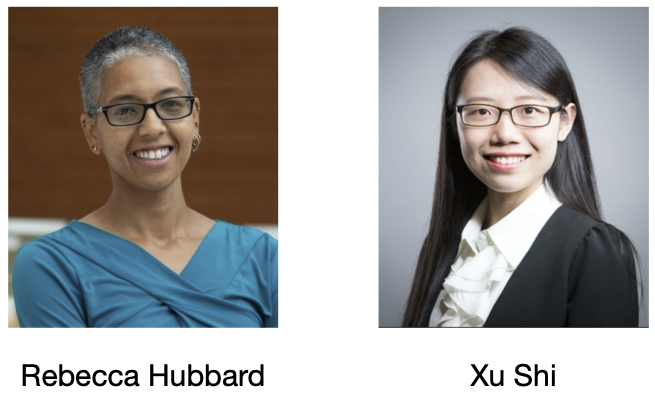

## Module 5: Regression Methods -- Concepts and Applications 
#### Instructors: [Rebecca Hubbard, PhD](https://www.med.upenn.edu/ehr-stats) (she/her/hers) and [Xu Shi, PhD](https://www.xuritashi.com) (she/her/hers)

### Welcome

### Overview
This module consists of a series of pre-recorded lectures that will introduce you to the basic concepts of regression for the analysis of associations between continuous or binary outcome variables and one or more predictor variables. Lectures are available for you to watch on your own and will be followed by interactive sessions in which we will go over any questions that you have and get hands-on experience applying these concepts to the analysis of data using R. Students are asked to **watch the recorded lectures in advance of live sessions and work through labs using R** (link to download **[R](https://cran.r-project.org/)** and **[RStudio](https://rstudio.com/products/rstudio/download/#download)**).

Link to zoom live sessions and recordings of the live sessions will be available when you log in to the [SISG website](https://si.biostat.washington.edu/suminst/SISG2022/modules/SM2105), and will also be emailed to participants (subtitle: "Welcome to SISG Module 5") and posted on Slack. 

### Schedule

**Wednesday 7/13**
* On your own: Simple Linear Regression -- Part 1 (**[video 40 mins](https://youtu.be/Hrbx_6zkxzw)**, **[slides](/slides/1_SimpleLinearRegression.pdf)** pages 1-32)
* On your own: Simple Linear Regression -- Part 2 (**[video 40 mins](https://youtu.be/vqfW5-ts9_U)**, **[slides](/slides/1_SimpleLinearRegression.pdf)** pages 32-58)
* Live session 1:15 -- 2:30am PT: Questions and lab exercises 1--3  (**[labs](/labs/2022_SISG_5_Labs.html)**, **[solutions](/labs/2022_SISG_5_Labs_Solutions.html)**, **[R codes](/labs/2022_SISG_5_Labs_Code.R)**, **[data](/data/SISG-Data-cholesterol.csv)**)

**Thursday 7/14**
* On your own: Model checking -- Part 1 (**[video 40 mins](https://youtu.be/ijHe7pmkcIQ)**, **[slides](/slides/2_ModelChecking.pdf)** pages 1-15)
* On your own: Model checking -- Part 2 (**[video 40 mins](https://youtu.be/-lV2ggV6twA)**, **[slides](/slides/2_ModelChecking.pdf)** pages 15-35)
* Live session 10:15 -- 11:30pm PT: Questions and lab exercises 4--6  (**[labs](/labs/2022_SISG_5_Labs.html)**, **[solutions](/labs/2022_SISG_5_Labs_Solutions.html)**, **[R codes](/labs/2022_SISG_5_Labs_Code.R)**)
* On your own: Multiple linear regression -- Part 1 (**[video 35 mins](https://youtu.be/slc_HqJmZr8)**, **[slides](/slides/3_MultipleLinearRegression.pdf)** pages 1-24)
* On your own: Multiple linear regression -- Part 2 (**[video 45 mins](https://youtu.be/glVDPDq89XI)**, **[slides](/slides/3_MultipleLinearRegression.pdf)** pages 24-49)
* Live session 1:15 -- 2:30am PT: Questions and lab exercises 7--8  (**[labs](/labs/2022_SISG_5_Labs.html)**, **[solutions](/labs/2022_SISG_5_Labs_Solutions.html)**, **[R codes](/labs/2022_SISG_5_Labs_Code.R)**)
* On your own: One-way ANOVA (**[video 53 mins]( https://youtu.be/iizDxDvx5Uk)**, **[slides](/slides/4_OneWayANOVA.pdf)** pages 1-44)

**Friday 7/15**
* On your own: Multiple comparisons and two-way ANOVA -- Part 1 (**[video 47 mins](https://youtu.be/y4C8eFH8dto)**, **[slides](/slides/5_MultipleComparisons_TwoWayANOVA.pdf)** pages 45-68)
* On your own: Multiple comparisons and two-way ANOVA -- Part 2 (**[video 42 mins](https://youtu.be/4VcdwE7Olfk)**, **[slides](/slides/5_MultipleComparisons_TwoWayANOVA.pdf)** pages 68-93)
* Live session 10:15 -- 11:30pm PT: Questions and lab exercises 9--12  (**[labs](/labs/2022_SISG_5_Labs.html)**, **[solutions](/labs/2022_SISG_5_Labs_Solutions.html)**, **[R codes](/labs/2022_SISG_5_Labs_Code.R)**)
* On your own: Logistic regression and generalized linear models -- Part 1 (**[video 45 mins](https://youtu.be/h12mvtkqj3c)**, **[slides](/slides/6_LogisticRegression.pdf)** pages 1-30)
* On your own: Logistic regression and generalized linear models -- Part 2 (**[video 27 mins](https://youtu.be/0Dgu5h7MwCs)**, **[slides](/slides/6_LogisticRegression.pdf)** pages 31-56)
* Live session 1:15 -- 2:30am PT: Questions and lab exercises 13--17  (**[labs](/labs/2022_SISG_5_Labs.html)**, **[solutions](/labs/2022_SISG_5_Labs_Solutions.html)**, **[R codes](/labs/2022_SISG_5_Labs_Code.R)**)

